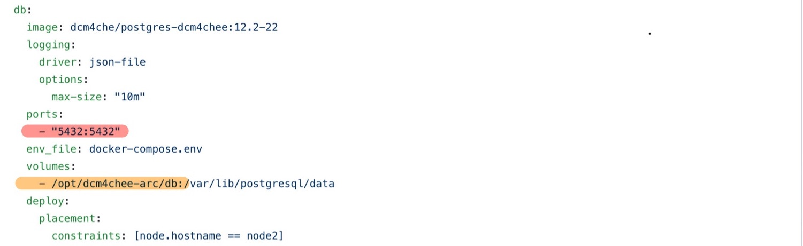
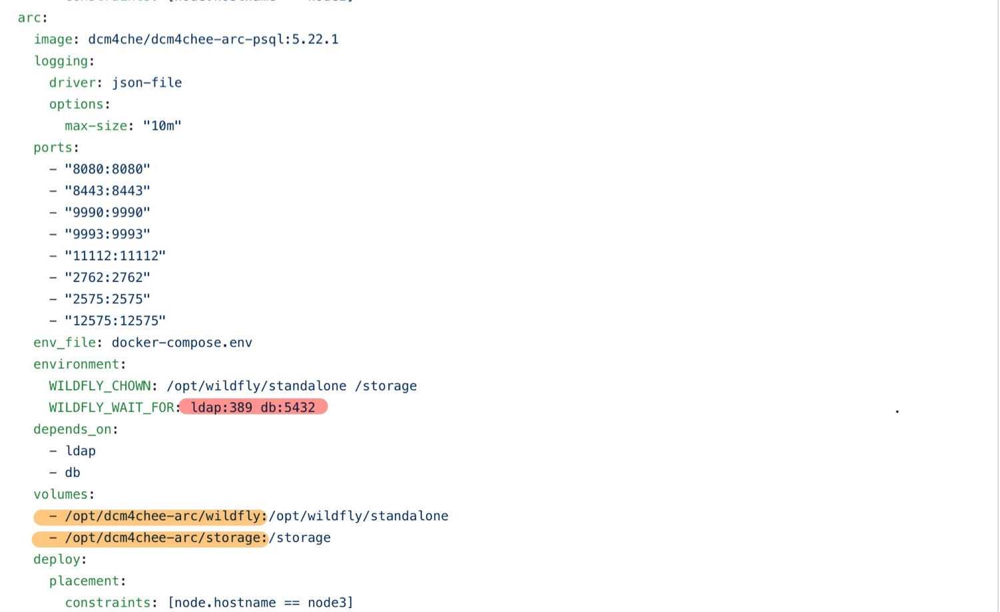

## About
This project is an integration of several key open-source software required for annotation and segmentation of DICOM images. The following software is used in this project:

 1. [dcm4chee-arc](https://www.dcm4che.org/)
 2. [OHIF Standalone Viewer](https://github.com/OHIF/Viewers)

## Getting Started
There are a few prerequisites for this project:

 1. [Docker](https://www.docker.com/get-started)
 2. [Node.js and npm](https://nodejs.org/en/)
 3. [Docker Machine](https://docs.docker.com/machine/install-machine/)
 4. [Virtual Box](https://www.virtualbox.org/wiki/Downloads)

## Docker Swarm Visualization 


### Docker-machine creation:
A docker machine instance can be created using the following command :
```
docker-machine create --driver virtualbox {Node name}
```
To access the created docker-machine :
 
 ```
 docker-machine ssh {Node name}
 ```
 
### Docker swarm creation:
```
$ docker swarm init --advertise-addr <NODE-IP>
```
Eg: 

```
$ docker swarm init --advertise-addr 192.168.99.100
Swarm initialized: current node (dxn1zf6l61qsb1josjja83ngz) is now a manager.

To add a worker to this swarm, run the following command:

    docker swarm join \
    --token SWMTKN-1-49nj1cmql0jkz5s954yi3oex3nedyz0fb0xx14ie39trti4wxv-8vxv8rssmk743ojnwacrr2e7c \
    192.168.99.100:2377

To add a manager to this swarm, run 'docker swarm join-token manager' and follow the instructions.
```
Follow the instructions in the code block to add worker nodes.


### Node1
On node1, we run Lightweight Directory Access Protocol (LDAP). The LDAP image that is used in our docker compose file is  [dcm4che/slapd-dcm4chee:2.4.48-22.1](https://hub.docker.com/layers/dcm4che/slapd-dcm4chee/2.4.48-22.1/images/sha256-5603997ca103fa695a1473ec95b9670055ac844806979d7eaa3e20ef4e97dba1?context=explore).This image requires two mount points :


The default mount points are indicated in bold. The mount points can be changed as per preference as long as they are present on node1. By default LDAP is available on port 389, but it can be changed as per user requirement. In order to make these changes, you must directly edit the docker-compose file, and re-deploy the stack.

### Node2
On node2, we run our database - postgres . The postgres image that is used in our docker compose file is [dcm4che/postgres-dcm4chee:12.2-22](https://hub.docker.com/r/dcm4che/postgres-dcm4chee).This image requires one mount point :

The default mount point is indicated in bold. The mount point can be changed as per preference as long as it is present on node2. The database running on node2 is a centralised database for the whole docker swarm, so it must be present on node2 to ensure centralised access to the whole docker swarm. By default the database would be running on port 5232, but it can be changed as per user requirement.

### Node3
On node3, we run the dcm4chee archive along with wildfly.  The dcm4chee archive image we use is [dcm4che/dcm4chee-arc-psql:5.22.1](https://hub.docker.com/r/dcm4che/dcm4chee-arc-psql).This image requires two point points: 

The default mount point is indicated in bold. The mount points can be changed as per preference as long as they are present on node3.  Our port configuration

**Ports for the webserver:**
 HTTP  on port 8080 
 HTTPS on port 8443
 
**Ports for wildfly administration:**
 HTTP on port 9990
 HTTPS on port 9993
 
**DICOM AE-title port :** 11112


**These ports should not be changed.**

**NOTE:**
By default, the nodes in the swarm are named node1, node2 and node3. You can name these however you want, as long as you maintain the names in docker-compose files and during the creation of the corresponding docker-machines.


### The basic deployment steps are as follows:

 1. Create a Docker swarm with 3 nodes. Name them **node1, node2 , node3 and node4**.
 
 2. On *node1* , run the following commands :
    ```
    cd /opt
    mkdir dcm4chee-arc
    cd dcm4chee-arc
    mkdir ldap
    mkdir slapd.d
    cd ~
    ```
 3. On *node2* , run the following commands:
 ```
    cd /opt
    mkdir dcm4chee-arc
    cd dcm4chee-arc
    mkdir db
    cd ~
 ```
 4. On *node3* , run the following commands:
  ```
    cd /opt
    mkdir dcm4chee-arc
    cd dcm4chee-arc
    mkdir wildfly
    mkdir storage
    cd ~
 ```
 5. On *node1* , clone this repository. 
 ```
 git clone https://github.com/kaiser-team/dcm4che-docker.git
 ```
 6. Go into the cloned reporsitory and run :
 ```
 docker stack deploy -c docker-compose.yml dcm4chee
 ```
Upon succesful deployment, DCM4CHEE will be on http://[docker-machine-ip]:8080/dcm4chee-arc/ui2. 

To run xnat on Node:  

1. First download docker-compose using the following commands on node4:
```
sudo curl -L "https://github.com/docker/compose/releases/download/1.25.5/docker-compose-$(uname -s)-$(uname -m)" -o /usr/local/bin/docker-compose
sudo chmod +x /usr/local/bin/docker-compose
```
2. After docker-compose has been installed, clone the following respoitory : 
```
git clone https://github.com/kaiser-team/xnat-docker-compose.git
```
3. CD into the xnat-docker-compose directory and run :
```
cd xnat-docker-compose
docker-compose up
```

## Uploading data

You can use common C-STORE methods such as storescu, storescp or the dicomWeb module to upload data into dcm4chee. Be sure to set up the correct AE Titles within dcm4chee. You can do this by going to the ui of your local dcm4chee and then navigating to **Configuration** in the hamburger menu icon.

Store-scu command :
```
storescu +sd -aec DCM4CHEE [docker-machine-ip] 11112 {absolute path to folder}
```
